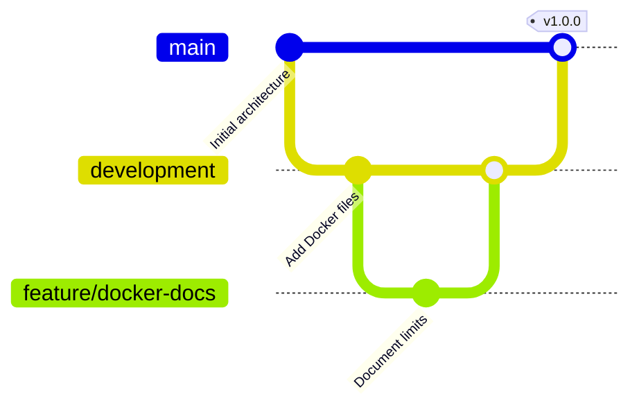
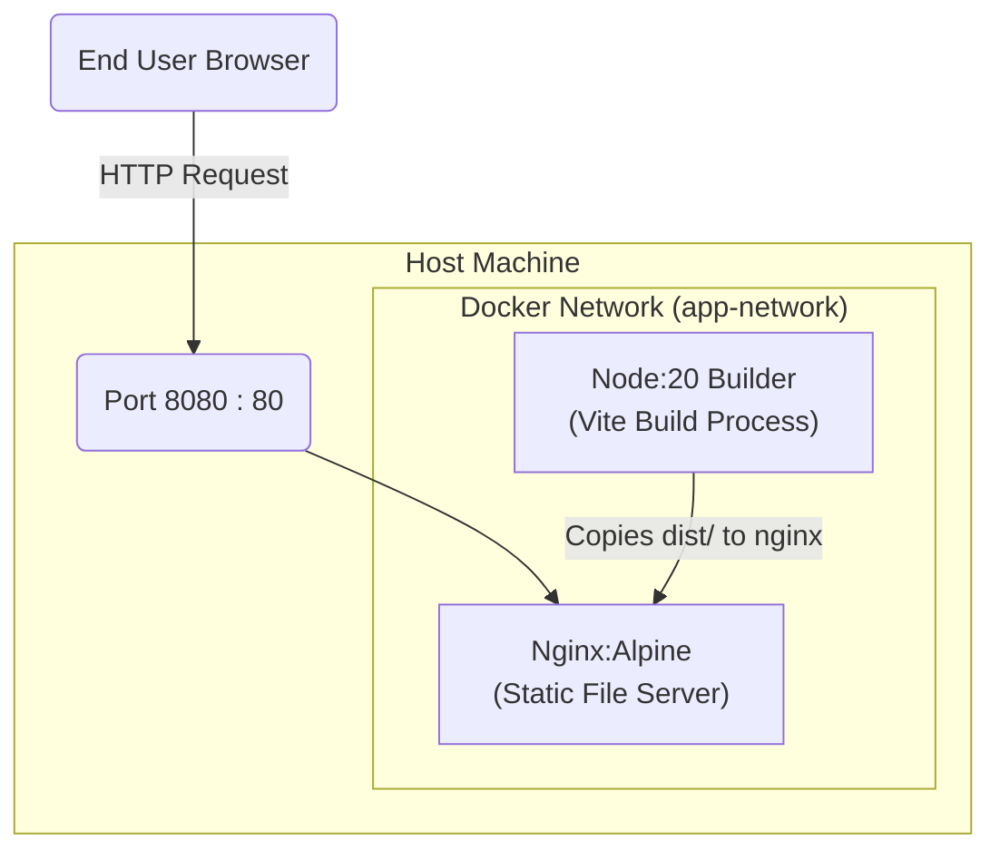

# CO3 ASSESSMENT TOOL 1 – Git & Docker Technical Assignment

**Course Code:** CSA10 / CSA1063
**Course Title:** Software Engineering
**CO Assessed:** CO3
**Student Name:** [Your Name]
**Reg. No:** [Your Registration Number]

---

## 1. Problem Analysis

**Project Objectives:**
The primary objective is to implement containerization and version control for "Nexus Shield View" (CyberShield 360), an AI-Based Enterprise Cybersecurity Monitoring & Threat Intelligence System. As a React/Vite-based frontend application, the goal is to standardize the deployment environment using Docker, orchestrate dependent services with Docker Compose, and establish a robust version control mechanism using Git.

**Functional Requirements:**
1. Maintain version control for all source files, configurations, and documentation.
2. Isolate the frontend application in a standardized container environment.
3. Automatically build and serve the production-ready static assets using a web server (Nginx).
4. Facilitate continuous integration by providing predictable branch management.

**Expected Outcomes:**
- A comprehensive Git history depicting real-world branching, committing, and merging strategies.
- A functional `Dockerfile` optimizing the Vite build process.
- A `docker-compose.yml` orchestrating the deployment.
- Seamless execution of the application regardless of the host machine's configuration.

---

## 2. Project Structure Design

The repository follows a modern React/Vite project structure with dedicated configuration files for TypeScript and Tailwind.

```
nexus-shield-view/
│
├── .git/                  # Git repository data
├── .gitignore             # Specifies intentionally untracked files
├── public/                # Static assets not processed by Vite
├── src/                   # React components, pages, and application logic
├── Dockerfile             # Multi-stage Docker build instructions
├── docker-compose.yml     # Orchestration file for Docker environments
├── package.json           # Node.js dependencies and script definitions
├── tsconfig.json          # TypeScript compiler configuration
└── vite.config.ts         # Vite bundler configuration
```

**Justification:**
- `src/`: Isolates business logic, UI components, and routing, adhering to standard frontend architectures.
- `public/`: Used for assets that remain unchanged throughout the build pipeline.
- `Dockerfile` & `docker-compose.yml`: Positioned at the root directory to properly define the build context and simplify container commands.

---

## 3. Git Repository Initialization

**Initialization Steps:**
To initialize the project for version control, the following command was executed at the project root:
```bash
git init
```
This created a hidden `.git` folder, indicating the starting point of version tracking. The repository was populated with `.gitignore` to prevent tracking of `node_modules`, build artifacts like `dist/`, and environment files (`.env`), thereby maintaining an optimized footprint.

---

## 4. Git Branching Strategy & Workflow Diagram

A modified **Git Flow** strategy is employed for this project.

- `main`: Stores the official release history. It only accepts merges from `development` or hotfix branches.
- `development`: Serves as an integration branch for features.
- `feature/*`: Created from `development` for developing new modules (e.g., `feature/docker-docs`).
- `hotfix/*`: Branches created from `main` to address critical bugs in production.

**Workflow Diagram:**


**Justification:**
This strategy provides clear isolation between unstable development work and stable production releases, preventing regressions and streamlining collaborative efforts.

---

## 5. Version Control Workflow

**Demonstration of Workflow:**
1. **Branch Creation**: New branches are created for specific tasks.
   `git checkout -b development`
2. **Committing Changes**: Meaningful snapshots of the codebase.
   `git add Dockerfile docker-compose.yml`
   `git commit -m "feat: Add containerization configurations for Docker"`
3. **Feature Development**:
   `git checkout -b feature/docker-docs`
   `git commit --allow-empty -m "docs: Document Docker configuration limits"`
4. **Merging**: Integrating the feature back into the development stream.
   `git checkout development`
   `git merge feature/docker-docs`

This process encapsulates a typical feature lifecycle, ensuring stable code integration.

---

## 6. Commit History Analysis

**Sample Commit History:**
```
*   (HEAD -> development) Merge branch 'feature/docker-docs' into development
|\
| * (feature/docker-docs) docs: Document Docker configuration limits
* | feat: Add containerization configurations for Docker
|/
*   (main) Initial setup: Project architecture and Vite configuration
```

**Analysis:**
The commit messages follow the **Conventional Commits** specification (`feat:`, `docs:`, `fix:`). This enhances the readability of the history, allows automated changelog generation, and aids in maintaining the project by rapidly identifying the scope of historical changes.

---

## 7. Docker Environment & Architecture Design

Docker is essential for this project because it guarantees consistency across all development and production environments, eliminating the "it works on my machine" problem.

**Architecture & Component Diagram:**


**Components Containerized:**
- The React/Vite build environment (using Node.js).
- The static file server (using Nginx) to securely and efficiently host the built application.

---

## 8. Dockerfile Development

The `Dockerfile` implements a multi-stage build.

```dockerfile
# Stage 1: Build
FROM node:20-alpine AS builder

WORKDIR /app
COPY package.json ./
RUN npm install

COPY . .
RUN npm run build

# Stage 2: Production Server
FROM node:20-alpine

WORKDIR /app
COPY --from=builder /app/.output /app/.output

# The Nitro/TanStack server runs using Node
ENV PORT=80
ENV NODE_ENV=production

EXPOSE 80

CMD ["node", ".output/server/index.mjs"]
```

**Instruction Purpose:**
- `FROM`: Defines the base image. `node:20-alpine` handles building; `nginx:alpine` handles serving.
- `WORKDIR`: Sets the working path for subsequent instructions.
- `COPY`: Transfers host files to the container. The second stage specifically pulls from the `builder` stage, keeping the final image tiny by excluding Node.js source files.
- `RUN`: Executes build scripts inside the temporary container.
- `EXPOSE`: Documents the port intended for communication.
- `CMD`: Determines the default executable when the container starts.

---

## 9. Docker Compose Design

The `docker-compose.yml` streamlines orchestrating the Nginx container container.

```yaml
version: '3.8'

services:
  web:
    build:
      context: .
      dockerfile: Dockerfile
    image: nexus-shield-view:latest
    container_name: nexus-shield-container
    ports:
      - "8080:80"
    restart: always
    environment:
      - NODE_ENV=production
    networks:
      - app-network

networks:
  app-network:
    driver: bridge
```

**Explanation:**
- `services`: Defines the container(s) running the application.
- `ports`: Maps host port 8080 to container port 80.
- `restart: always`: Ensures the container auto-restarts upon daemon start or crash.
- `networks`: Encapsulates the container in an isolated overlay network (`app-network`).

---

## 10. Container Deployment and Testing

**Execution:**
Start the application using:
```bash
docker-compose up -d --build
```

**Testing Procedure:**
Once the container initializes, testing involves navigating to `http://localhost:8080` in a web browser. The successful render of the "CyberShield 360" UI confirms that dependencies were correctly installed, the Vite payload was successfully transpiled, and Nginx is properly serving the `dist` directory. To view logs:
```bash
docker logs nexus-shield-container
```

---

## 11. Benefits of Git and Docker

- **Git Migration & Collaboration**: Enables multiple team members to work on React components simultaneously without overwriting progress.
- **Version Management**: Every iteration is tracked; reverting to older UI states is instantaneous.
- **Portability (Docker)**: Guarantees that Node/Nginx software versions are exactly mirrored globally.
- **Deployment & Scalability**: The containerized image can securely run on AWS ECS, Kubernetes, or any orchestration engine, simplifying rapid horizontal scaling.
- **Maintainability**: The encapsulated multi-stage Dockerfile natively prevents server bloat (a Node backend runtime isn’t shipped in production).

---

## 12. Challenges and Improvements

**Challenges Encountered:**
- Caching dependencies dynamically based on `package.json` vs transferring the entire source directory required splitting the `COPY` commands in the Dockerfile.
- Mitigating image size vulnerabilities. Transitioning from standard `node` and `nginx` images to `alpine` variants drastically cut the final image size.

**Future Enhancements:**
- Enforcing GitHub Actions (CI/CD) pipelines inside Git to auto-build Docker images alongside pull request validations.
- Expanding Docker Compose with backend API containers (e.g., Python/FastAPI) representing the mock threat intel services to formulate a functional full-stack architecture.
