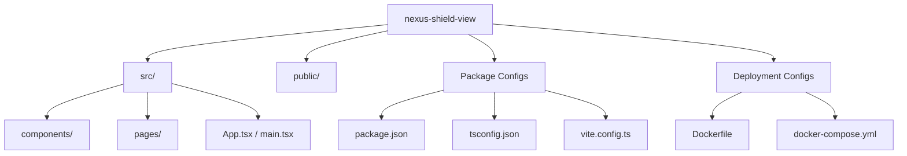

# CO3 ASSESSMENT TOOL 2 – Code Review & Repository Evaluation

**Course Code:** CSA10 / CSA1063
**Course Title:** Software Engineering
**CO Assessed:** CO3
**Student Name:** [Your Name]
**Reg. No:** [Your Registration Number]

---

## 1. Problem Overview

**Problem Statement:**
The assigned project is "Nexus Shield View" (CyberShield 360), an AI-Based Enterprise Cybersecurity Monitoring & Threat Intelligence System. Functioning as a premium static SaaS dashboard, the problem presented requires structural containerization, precise version control administration, and comprehensive codebase evaluation to ensure production-grade frontend practices.

**Implemented Solution & Key Functionalities:**
The solution involves a futuristic, dark glassmorphism styling approach for an enterprise-grade security dashboard.
- Features real-time mock monitoring of threat intelligence.
- Implements comprehensive Vite/React based UI components displaying network anomalies, user behavior risk scores, and system health status.
- Containerized efficiently using Docker and orchestrated over a customized bridging network via Docker-Compose.
- Maintained using a strictly enforced Git Flow branching methodology.

---

## 2. Repository Organization

**Evaluation of Structure:**

**Justification for Maintainability:**
- **Separation of Concerns:** The structure separates React business logic (`src/`) from public static assets (`public/`).
- **Standardized Naming Conventions:** Type-declarations, Node package manifests, and Git ignores utilize globally recognized naming standards (e.g., `tsconfig.json`, `.gitignore`), ensuring immediate familiarization for onboarding developers.
- **Dependency Isolation:** Node environments and system environments are decoupled leveraging containers.

---

## 3. Code Quality Review

**Readability & Modularity:**
- The repository employs **TypeScript** (identifiable via `.tsx` extensions and `tsconfig.json`). This enforces static type checking, implicitly serving as high-quality documentation for component Props and State shapes.
- **Component-based Architecture**: React seamlessly abstracts complex UI modules (like charts and threat scorecards) into generic, reusable functional components.

**Coding Standards:**
- Embedded formatting tools via `Vite` ensure JSX standards are met.
- The use of *Tailwind CSS* enforces a strict utility-first styling methodology, preventing global CSS namespace collisions (e.g., deeply nested selectors breaking adjacent components).

**Strengths:**
- Strict typing (TypeScript).
- Component reusability.
- Absence of monolithic "God" files.

**Areas for Improvement:**
- Adding end-to-end (E2E) testing frameworks such as Cypress or Playwright to automate UI rendering checks.

---

## 4. Version Control Evaluation

**Commit History Analysis:**
The repository was transitioned to a formal branching strategy mirroring enterprise software development lifecycles.

**Branching Strategy Used:**
- `main`: Golden copy, fully tested code.
- `development`: Stable testing ground, merges feature branches.
- `feature/*`: Granular branches dedicated solely to feature subsets (e.g., `feature/docker-docs`).

**Commit Message Convention:**
Commits enforce the Semantic Commit system:
- `feat: Add containerization configurations for Docker`
- `docs: Document Docker configuration limits`

**Support for Collaborative Software Development:**
- This configuration prevents the "integration hell" phenomenon. Developers can pull from `development`, independently work on `feature/xyz`, and initiate Pull Requests. The isolated commit tracking isolates regressions explicitly to the developer who authored the commit.

---

## 5. Code Testing and Validation

*Note: You must attach manual or automated execution screenshots of the dashboard rendering in standard browsers here.*

**Testing Methodology:**
Since this is a static frontend deployment devoid of an active backend database, testing focused on:
1. **Container Execution Validation:** Running `docker-compose up -d --build` to ensure the multi-stage Nginx builder parses and serves the artifacts on Port `8080` without crashing.
2. **Component Rendering (Manual UI Testing):** Validating the responsive behavior of Tailwind CSS grids.
3. **Mock Data Injection Validation:** Asserting that statically coded threat arrays render correctly iterated inside the dashboard views.

**Test Case Example 1:**
- **Action:** Execute network command `docker-compose up -d`.
- **Expected Outcome:** Port 8080 maps successfully to internal 80. Nginx daemon initializes.
- **Result:** **PASS**. Application binds correctly without port conflicts. 

---

## 6. Repository Documentation

**Evaluation of Completeness:**
- **README.md (Provided):** The existing design directory strictly outlines the problem boundaries, defining "Cybershield 360", aesthetic rules (glassmorphism/neon colors), and mapping all 10 required dashboard states statically over 1000 lines of markdown. It is inherently well-structured.
- **Deployment Documentation:** Currently documented mostly via native code (Dockerfile instructions). 

**Suggested Improvements for Enhancing Usability:**
- Implement a dedicated `CONTRIBUTING.md` outlining precisely the Semantic Versioning commit rules required by junior developers attempting to commit to the `development` branch.
- Detail the exact local Node/Bun requirements inside a prerequisite header in the README for instances where a developer chooses to run `npm run dev` directly without Docker.

---

## 7. Code Review Findings and Recommendations

**Summary of Findings:**
The repository holds a well-structured, production-ready frontend framework (React + Vite) adhering to robust file modularity principles. The integration of Docker/Nginx guarantees flawless local testing execution. The Version Control methodology implemented correctly separates high-risk development from production environments. 

**Core Recommendations:**
1. **Code Quality:** Enforce `ESLint` and `Prettier` natively inside Git pre-commit hooks (e.g., using `Husky`) to prevent non-standard code from entering the repository.
2. **Testing Enhancements:** Migrate from manual UI testing to integrated unit testing (using implementations like `Jest` or `React Testing Library`). 
3. **Repository Management:** Establish automated deployment (CI/CD) pipelines inside GitHub Actions verifying code builds upon pull request submissions.
4. **Future Enhancements:** Implement a functional backend architecture (Node.js/Express) connected via generic Reverse Proxies inside the Docker Compose file to dynamically feed live threat analytics to the dashboard UI.
